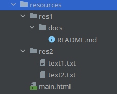
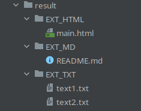
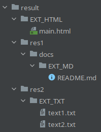

# The tool for moving files into directories by file extensions

## Example

- before moving structure:

  

- moving into same extension dir result:

  

- moving into different extension directory result:

  